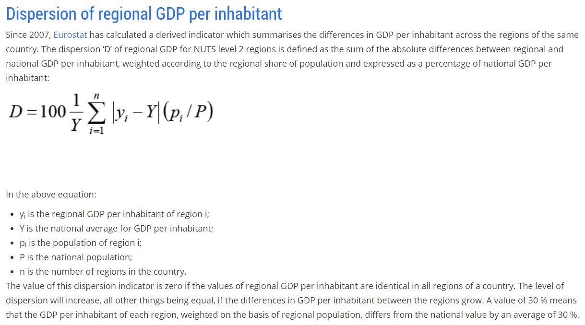

# GDPDispersion
Calculating GDP dispersion (regional inequality) within Europe.

# What is GDP dispersion?
GDP dispersion is calculated as defined by Eurostat using the following formula.

# Why create a UK* measure?
Regional inequality measures can be distorted if any of the regions used are smaller than functional economic areas, specifically where there is significant commuting between different regions. The methods I have created use NUTS2 regions, since these are as small as possible while almost never being smaller than a functional economic area. There is a single major exception to this rule though, London. 
France refuses to split the NUTS1 region of Île-de-France (Greater Paris) into NUTS2 regions. Spain refuses to split the NUTS1 region of Comunidad de Madrid (Greater Madrid) into NUTS2 regions. But the UK does split the NUTS1 region of London (Greater London) into NUTS2 regions. This reduces the comparability of data on GDP dispersion across nations.
To fix this we create the UK* measure. This calculates GDP dispersion using NUTS2 regions for the UK except for London, where we remove all the NUTS2 regions for London and instead use the single NUTS1 region.

# What about the additional measures like Thiel Index and Income Dispersion?
I have included formulas to calculate additional measures including Thiel Index and Income Dispersion. These have not been checked and are not safe to use. If you can check and fix these that would be great!

# Why don't we have historic data for France and The Netherlands?
France and The Netherlands recently redefined their regions. Eurostat no longer share (or I can't find) their old data, so we only have recent data.

# Why isn't there a whole EU dataset?
The EU as a whole is a bit complicated because countries have joined and left over time. I'm working on calculating a whole EU number (which will include the UK* correction) but I haven't made it work yet.
